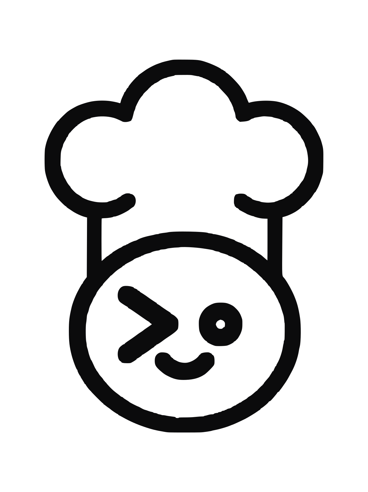

<p align="center">
  <picture>
    <source media="(prefers-color-scheme: dark)" srcset=".github/assets/skillet-mark-light.svg">
    
  </picture>
</p>

<h1 align="center">Skillet</h1>

<p align="center">
  A registry and sync system for agent skills.<br>
  Publish a skill once, run it in every agent runtime.
</p>

<p align="center">
  <a href="https://www.npmjs.com/package/skilletmd"></a>
  <a href="https://github.com/skilletmd/skillet/actions/workflows/ci.yml"></a>
  <a href="LICENSE"></a>
</p>

<p align="center">
  <a href="https://skillet.md">skillet.md</a> &nbsp;·&nbsp;
  <a href="docs/README.md">Docs</a> &nbsp;·&nbsp;
  <a href="https://skillet.md/download">Download the app</a>
</p>

---

## What it is

A skill is a folder with a `SKILL.md` in it, in the open
[agentskills.io](https://agentskills.io) format. Skillet keeps one canonical
copy of each skill, versions and signs it, and materializes it into each
runtime's native format.

## Features

### Summon a handle's skills, nothing installed

Paste a line naming a handle and a task. The agent fetches that handle's public
skills, matches the task against the descriptions, and applies the one that
fits.

```
Read skillet.md/@mattpocock/summon and use their best skill to review my PR
```

No account, no CLI, nothing on disk. Any agent that can fetch a URL works.
Narrow it to one kit with `skillet.md/@handle/kit/slug/summon`.
See [Summon a kit](https://skillet.md/docs/summon).

### Sync across runtimes

```bash
npx skilletmd
```

Passwordless sign-in; one pair code links a machine. Skillet then writes each
skill into every runtime you connect, in that runtime's native format. Edit
once, every runtime gets it.

`/skillet <task>` routes across your own kit. `/skillet @handle <task>` summons
someone else's.

A tray app syncs in the background, so a skill published on one machine reaches
the others without running anything.

| Platform | Requirements | |
| --- | --- | --- |
| macOS | Apple Silicon, macOS 13 Ventura or later | [Download](https://skillet.md/download/mac) |
| Windows | 64-bit, Windows 10 or later | [Download](https://skillet.md/download/windows) |

Both are code-signed and auto-update. Installers are also attached to every
[release](https://github.com/skilletmd/skillet/releases).

### Publish

Publish from your editor or a linked GitHub repo. One versioned, signed
artifact per skill, shareable as a link.
See [Publish a skill](https://skillet.md/docs/publish).

### Follow people

Follow an author and their new skills appear in your feed, one click to add.
The feed ranks by who you follow, not by install count. Browse the catalog at
[skillet.md/browse](https://skillet.md/browse).

### Private kits for teams

A shared kit holds skills that never reach the public catalog. Every member and
every machine runs the same approved version. A headless CI runner gets a
**kit-key**: a scoped, revocable credential that pulls exactly one kit.
See [Teams and shared kits](docs/private-kits.md).

## Updates and scanning

**Updates wait for approval.** When an author ships a new version of a skill you
use, it waits in [Updates](https://skillet.md/updates) until you approve that
specific version. Approval is per version, not a standing grant, and the web is
the only place it happens.

**Every published version is scanned.** Skills are instructions an agent will
act on, so each version is scanned before it is served, and quarantined content
is never downloadable. Verdicts are public.
[What the scanner catches, and what it cannot](https://skillet.md/docs/safety).

## Runtimes

One skill materializes into each runtime's native format:

`claude-code` · `codex` · `cursor` · `devin` · `hermes` · `openclaw` ·
`opencode` · `windsurf`

Plus an MCP server for any MCP-aware agent, which covers ChatGPT, Claude.ai, and
Claude Desktop. `codex` and `opencode` both read `.agents/skills`, so one
materialization serves both.

## Docs

| | |
| --- | --- |
| [Docs index](docs/README.md) | Everything, organized |
| [Concepts](CONCEPTS.md) | The vocabulary: skills, kits, adapters, devices |
| [Private kits](docs/private-kits.md) | Team and CI access |
| [Operating a registry](docs/operating-a-registry.md) | Run your own: deploy, migrations, security invariants |
| [Registry API](docs/registry-api.md) | Generated HTTP route map |

Every page on skillet.md also serves clean Markdown at the same URL to a client
that asks for `Accept: text/markdown`, and the public catalog is a credential-free
JSON API described at [/openapi.json](https://skillet.md/openapi.json). Agents
should start at [/llms.txt](https://skillet.md/llms.txt).

## Development

A pnpm monorepo. Setup, conventions, and the checks to run before pushing are in
**[CONTRIBUTING.md](CONTRIBUTING.md)**.

| Package | What it is |
| --- | --- |
| `web` | Next.js app ([skillet.md](https://skillet.md)) — catalog, profiles, sign-in, and the BFF that signs and proxies internal registry calls. |
| `registry` | Fastify + Prisma/MySQL API — versioning, kits, profiles, ETag/304 sync, publish, auth. The source of truth. |
| `cli` | `skilletmd` (binary: `skillet`) — pair-first sync: link a machine, then sync, import, publish. |
| `desktop` | Tauri tray app — background syncer for macOS and Windows. |
| `core` | Shared sync, identity, and session-token logic used by the CLI and web. |
| `protocol` | The `SKILL.md` format, reserved-handle rules, and format evals. |
| `mcp` | MCP server exposing Skillet to MCP-aware agents. |
| `adapters/*` | Per-runtime materializers, one per runtime listed above. |

The web app never talks to the registry database directly. It calls the registry
over an internal API, signing each privileged call with an HMAC the registry
verifies. If you are deploying this, the
[security invariants](docs/operating-a-registry.md#security-invariants-do-not-skip)
are not optional.

## Contributing

Start with [CONTRIBUTING.md](CONTRIBUTING.md). Report vulnerabilities per
[SECURITY.md](SECURITY.md) rather than in a public issue. Be excellent to each
other: [CODE_OF_CONDUCT.md](CODE_OF_CONDUCT.md).

Licensed under [Apache-2.0](LICENSE).
